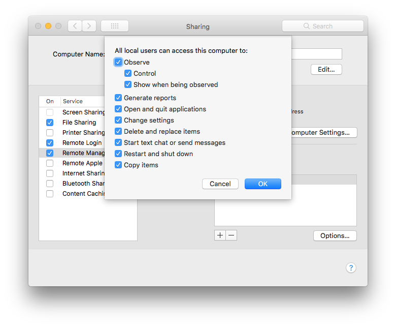

ard
===

Use the **ard** resource to manage the "Remote Management" settings, found in System
Preferences > Sharing > Remote Management. Under the hood, the [**ard**](https://github.com/Microsoft/macos-cookbook/blob/master/resources/ard.rb) resource
executes the `kickstart` command, located in ARDAgent.app (one of macOS' "core services").

Syntax
------

The **ard** resource block declares a basic description of the command configuration
and a set of properties depending on the actions executed. For example:

```ruby
ard 'activate and configure ard' do
  action [:activate, :configure]
end
```

where

- `:activate` activates the ARD agent
- `:configure` configures the agent using the `kickstart` default commandline arguments.

The default `:configure` action is equivalent to the following
**System Preferences > Sharing** settings:



The full syntax for all of the properties that are available to the **ard**
resource is:

```ruby
ard 'description' do
  install_package                String
  uninstall_options              Array # defaults to ['-files', '-settings', '-prefs'] if not specified
  restart_options                Array # defaults to ['-agent', '-console', '-menu'] if not specified
  users                          Array
  privs                          Array # defaults to ['-all'] if not specified
  access                         String # defaults to '-on' if not specified
  allow_access_for               String # defaults to '-allUsers' if not specified
  computerinfo                   Array
  clientopts                     Array
  action                         Symbol # defaults to [:activate, :configure] if not specified
end
```

:warning: Not all properties are compatible with each action. For example, the
`uninstall_options` property is only applicable when the `:uninstall` action is used.

Actions
-------

This resource has the following actions:

`:activate`

&nbsp;&nbsp;&nbsp;&nbsp;&nbsp;&nbsp;Activate the remote desktop agent.

`:deactivate`

&nbsp;&nbsp;&nbsp;&nbsp;&nbsp;&nbsp;Deactivate the remote desktop agent.

`:uninstall`

&nbsp;&nbsp;&nbsp;&nbsp;&nbsp;&nbsp;Uninstall a package from another remotely
managed Mac.

`:stop`

&nbsp;&nbsp;&nbsp;&nbsp;&nbsp;&nbsp;Stop the agent.

`:restart`

&nbsp;&nbsp;&nbsp;&nbsp;&nbsp;&nbsp;Restart the remote desktop agent.

`:configure`

&nbsp;&nbsp;&nbsp;&nbsp;&nbsp;&nbsp;Configure the setup of the remote desktop
agent using the default options.

Properties
----------

`install_package`

&nbsp;&nbsp;&nbsp;&nbsp;&nbsp;&nbsp;**Ruby Type:** `String`

`uninstall_options`

&nbsp;&nbsp;&nbsp;&nbsp;&nbsp;&nbsp;**Ruby type:** `Array`

&nbsp;&nbsp;&nbsp;&nbsp;&nbsp;&nbsp;default options: `['-files', '-settings', '-prefs']`

`restart_options`

&nbsp;&nbsp;&nbsp;&nbsp;&nbsp;&nbsp;**Ruby type:** `Array`

&nbsp;&nbsp;&nbsp;&nbsp;&nbsp;&nbsp;default options: `['-agent', '-console', '-menu']`

`users`

&nbsp;&nbsp;&nbsp;&nbsp;&nbsp;&nbsp;**Ruby type:** `Array`

`privs`

&nbsp;&nbsp;&nbsp;&nbsp;&nbsp;&nbsp;**Ruby type:** `Array`

&nbsp;&nbsp;&nbsp;&nbsp;&nbsp;&nbsp;default: `['-all']`

`access`

&nbsp;&nbsp;&nbsp;&nbsp;&nbsp;&nbsp;**Ruby type:** `String`

&nbsp;&nbsp;&nbsp;&nbsp;&nbsp;&nbsp;default: `'-on'`

`allow_access_for`

&nbsp;&nbsp;&nbsp;&nbsp;&nbsp;&nbsp;**Ruby type:** `String`

&nbsp;&nbsp;&nbsp;&nbsp;&nbsp;&nbsp;default: `'-allUsers'`

`computerinfo`

&nbsp;&nbsp;&nbsp;&nbsp;&nbsp;&nbsp;**Ruby type:** `Array`

`clientopts`

&nbsp;&nbsp;&nbsp;&nbsp;&nbsp;&nbsp;**Ruby type:** `Array`

`action`

&nbsp;&nbsp;&nbsp;&nbsp;&nbsp;&nbsp;**Ruby type:** `Symbol`
