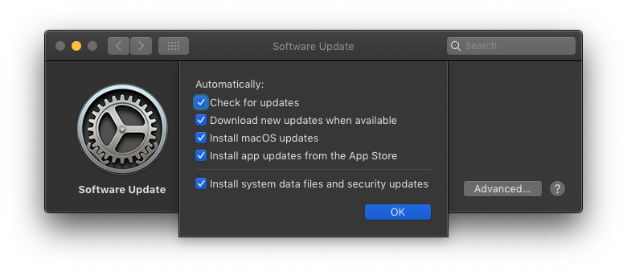

automatic_software_updates
=====

Use the **automatic_software_updates** resource to manage the Automatic Software Update preferences.

The [**automatic_software_updates**](https://github.com/Microsoft/macos-cookbook/blob/master/resources/automatic_software_updates.rb) resource manages the state of the desired software update preference using the **plist** resource to set the values for each individual property.



Syntax
------

The simplest use of the **automatic_software_updates** resource is:

```ruby
automatic_software_updates "enables automatic check, download, and install of software updates" do
  check true
  download true
  install_os true
  install_app_store true
  install_critical true
end
```

## Actions

The ``automatic_software_updates`` resource has the following actions:

``:set``

&nbsp;&nbsp;&nbsp;&nbsp;&nbsp;&nbsp;Default. Set `plist` attribute to true.

Properties
----------

`check`

&nbsp;&nbsp;&nbsp;&nbsp;&nbsp;&nbsp;**Ruby type:** `TrueClass, FalseClass`

&nbsp;&nbsp;&nbsp;&nbsp;&nbsp;&nbsp;Enable or disable automatic checking of software updates.

`download`

&nbsp;&nbsp;&nbsp;&nbsp;&nbsp;&nbsp;**Ruby type:** `TrueClass, FalseClass`

&nbsp;&nbsp;&nbsp;&nbsp;&nbsp;&nbsp;Enable or disable automatic download of software updates. Only applicable if the `check` property is `true`.

`install_os`

&nbsp;&nbsp;&nbsp;&nbsp;&nbsp;&nbsp;**Ruby type:** `TrueClass, FalseClass`

&nbsp;&nbsp;&nbsp;&nbsp;&nbsp;&nbsp;Enable or disable automatic install of OS updates.
Only applicable if the `download` property is `true`.

`install_critical`

&nbsp;&nbsp;&nbsp;&nbsp;&nbsp;&nbsp;**Ruby type:** `TrueClass, FalseClass`

&nbsp;&nbsp;&nbsp;&nbsp;&nbsp;&nbsp;Enable or disable automatic install of critical updates.
Only applicable if the `check` property is enabled

`install_app_store`

&nbsp;&nbsp;&nbsp;&nbsp;&nbsp;&nbsp;**Ruby type:** `TrueClass, FalseClass`

&nbsp;&nbsp;&nbsp;&nbsp;&nbsp;&nbsp;Enable or disable automatic install of application updates from the app store.
Only applicable if the `download` property is `true`.

Examples
----------

**Enable automatic checking of software updates**

```ruby
automatic_software_updates "enable automatic checking of software updates" do
  check true
  download false
  install_os false
  install_app_store false
  install_critical false
end
```
