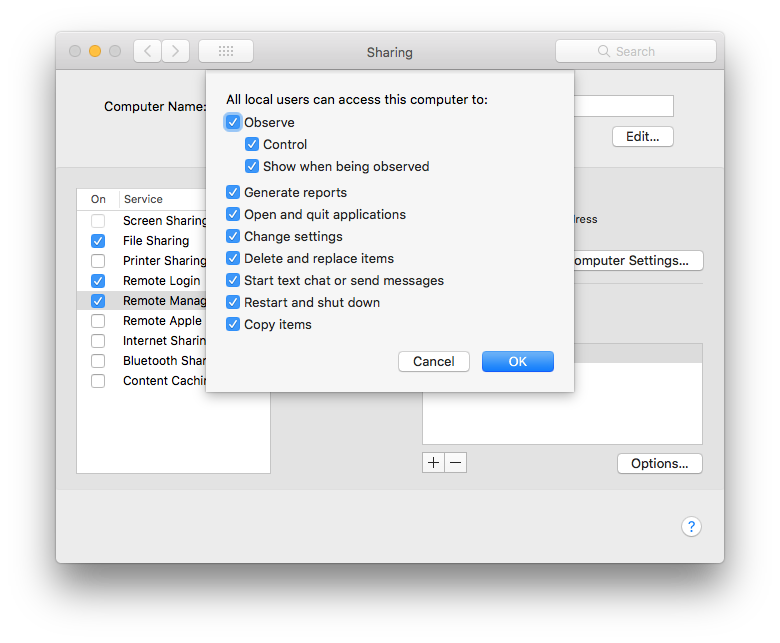

remote_management
===

Use the **remote_management** resource to manage the "Remote Management" settings, found in System
Preferences > Sharing > Remote Management. Under the hood, the [**remote_management**](https://github.com/Microsoft/macos-cookbook/blob/master/resources/remote_management.rb) resource
executes the `kickstart` command, located in ARDAgent.app (one of macOS' "core services").

Syntax
------

The **remote_management** resource block declares a basic description of the command configuration
and an action executed. For example:

```ruby
remote_management 'enable remote management' do
  action :enable
end
```

where

- `:enable` activates remote management and configures full privileges for all users on the system.
- `:disable` deactivates the remote management agent and prevents it from activating at boot time.

The default `:enable` action is equivalent to configuring the following
**System Preferences > Sharing** settings:



The full syntax for all of the properties that are available to the **remote_management**
resource is:

```ruby
remote_management 'description' do
  action                         Symbol # defaults to [:enable] if not specified
end
```

Actions
-------

This resource has the following actions:

`:enable`

&nbsp;&nbsp;&nbsp;&nbsp;&nbsp;&nbsp;Activate remote management and configure full privileges for all users on the system.

`:disable`

&nbsp;&nbsp;&nbsp;&nbsp;&nbsp;&nbsp;Deactivate the remote management agent and prevent it from activating at boot time.
